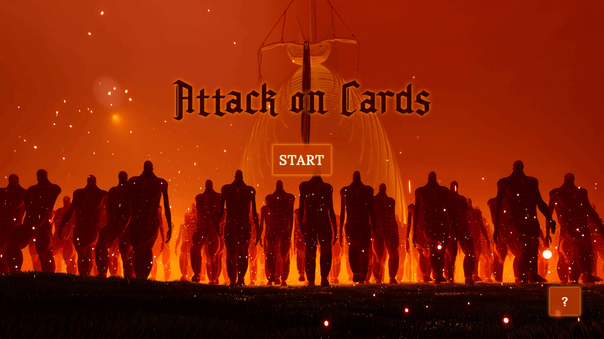

# Attack on Cards

A Memory Card game built with React for TheOdinProject.
Challenge your memory skills with this game! Rack up points by selecting different cards, but be careful not to click on the same card twice or you'll lose all your hard-earned points!
Keep playing to unlock all 15 cards (≧∇≦)ﾉ

## Learnings

✧ Vite: importing multiple modules from the file system  
✧ Fisher-Yates shuffle algorithm 
✧ backdrop-filter CSS property 
✧ Lifecycle methods as per lessons(Though didn't find the need to use them here) 

## Preview

### Start Screen

### Game Screen

## Demo

👉 [Live Demo](https://ruchita1010.github.io/attack-on-cards)
